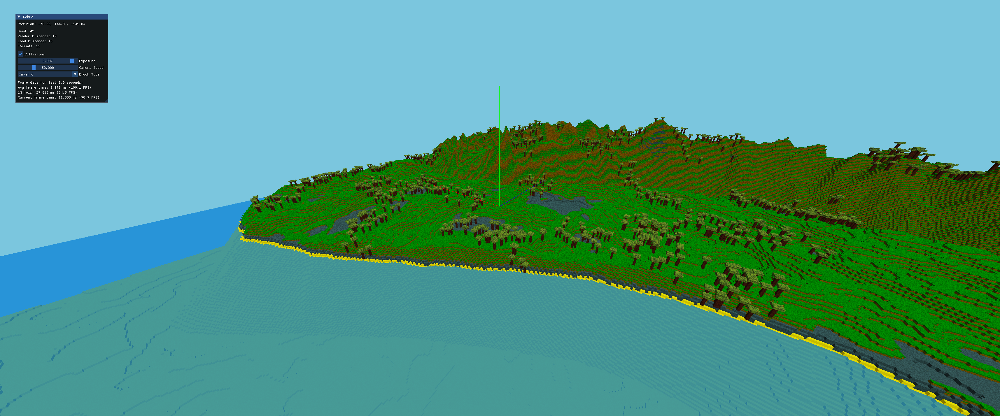

# Hi, I'm a readme file



## About
This voxel game is my graphics programming playground. The main focus is on performance optimizations and learning opengl.

## Build Process
Install cmake and run ```bash build.sh``` in your terminal. 
This will create a build directory and compile the project. The program takes a path to a config file as an optional argument. 
If no config file is provided, the program will use default values and create a new database in the same directory for the save file.
For an example config file, see `resources/example.config`.

## Controls
- `WASD` / `SHIFT` / `SPACE` to move around
- `ESC` to quit
- `V` toggle mouse cursor
- `F3` to toggle debug mode
- `F5` refresh (drop all chunks)

## Roadmap / Features
- [ ] graphics & optimizations
  - [x] 1 int -> 1 vertex
  - [x] 1 int -> whole face
  - [x] imgui debug menu
  - [x] face culling
  - [ ] frustum culling
  - [x] multithreading
    - [x] chunk loading
    - [x] chunk unloading
    - [x] mesh generation
  - [x] 32^3 chunks
  - [x] translucent blocks 

- [ ] game mechanics
  - [x] collisions
  - [x] infinite world
    - [x] chunk system
    - [x] chunk loading
    - [x] chunk unloading
  - [ ] world generation
    - [x] terrain height 
    - [x] biomes
    - [x] trees
    - [ ] ores
    - [ ] caves
    - [ ] structures
  - [x] placing and breaking blocks
  - [ ] particle system
  - [x] save game & config file
  - [ ] entities
    - [x] hitbox
    - [x] gravity
    - [ ] behavior
    - [ ] model & animation
  - [ ] day/night cycle
  - [ ] console/commands

- [ ] tools
  - [ ] profiler

[demo.mp4](https://github.com/user-attachments/assets/9e8c9132-b0e0-42e2-b421-7ddd6451fb57)

## Libraries
- [glad](https://github.com/Dav1dde/glad) - OpenGL loading
- [glfw](https://github.com/glfw/glfw) - Window managing
- [glm](https://github.com/g-truc/glm) - Quick math library, because I'm not a psychopath
- [stb_image](https://github.com/nothings/stb/blob/master/stb_image.h) - Loading texture atlas
- [cstmlib](https://github.com/DeletedMyEmail/CustomLibs) - Logging and profiling
- [FastNoiseLite](https://github.com/Auburn/FastNoiseLite) - Noise generation
- [libconfig](https://github.com/hyperrealm/libconfig) - Config file parsing
- [SQLiteCpp](https://github.com/SRombauts/SQLiteCpp) - Database for save games
- [imgui](https://github.com/ocornut/imgui) - Rendering debug menu
