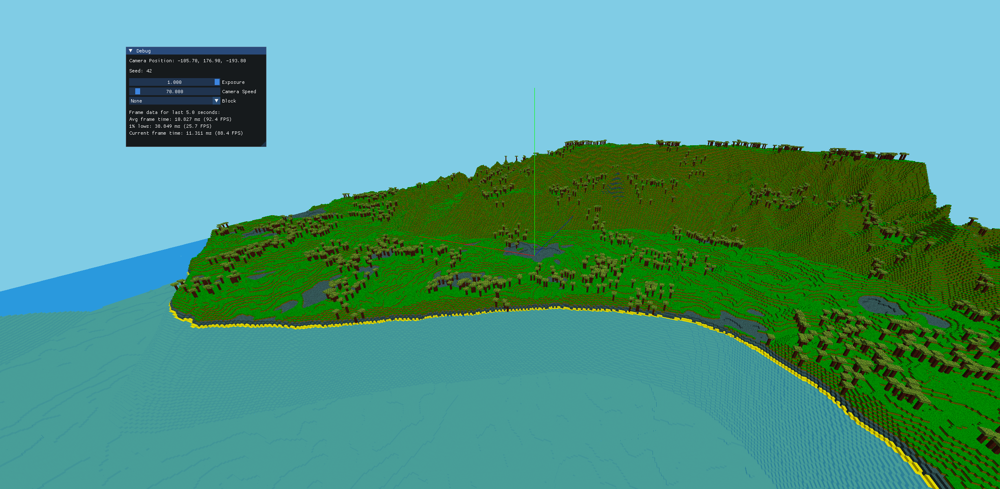

# Hi, I'm a readme file



### Build Process
Install cmake and run ```bash build.sh``` in your terminal. 
This will create a build directory and compile the project.

### Controls
- `WASD` / `SHIFT` / `SPACE` to move around
- `TAB` to toggle debug mode
- `ESC` to quit
- `V` toggle mouse cursor
- `X` refresh (drop all chunks)

### Roadmap / Features
- [ ] graphics & optimizations
  - [x] 1 int -> 1 vertex
  - [x] 1 int -> whole face
  - [x] imgui debug menu
  - [x] face culling
  - [ ] frustum culling
    - [x] simple circular frustum culling 
    - [ ] more complex version
  - [x] multithreading
    - [x] chunk loading
    - [x] chunk unloading
    - [x] mesh generation
  - [x] less mem fragmentation in the chunk manager
  - [x] 32^3 chunks
  - [x] translucent blocks 
  - [ ] binary meshing
  - [ ] chunk empty flag

- [ ] game mechanics
  - [x] collisions
  - [x] infinite world
    - [x] chunk system
    - [x] chunk loading
    - [x] chunk unloading
  - [ ] world generation
    - [x] terrain height 
    - [x] biomes
    - [x] trees
    - [ ] ores
    - [ ] caves
    - [ ] structures
  - [x] placing and breaking blocks
  - [ ] particle system

### Libraries
- [spdlog](https://github.com/gabime/spdlog) - Logging 
- [glad](https://github.com/Dav1dde/glad) - OpenGL loading
- [glfw](https://github.com/glfw/glfw) - Window managing
- [glm](https://github.com/g-truc/glm) - Quick math library, because I'm not a psychopath
- [stb_image](https://github.com/nothings/stb/blob/master/stb_image.h) - Loading texture atlas
- [glText](https://github.com/vallentin/glText) - Text rendering
- [FastNoiseLite](https://github.com/Auburn/FastNoiseLite) - Noise generation
